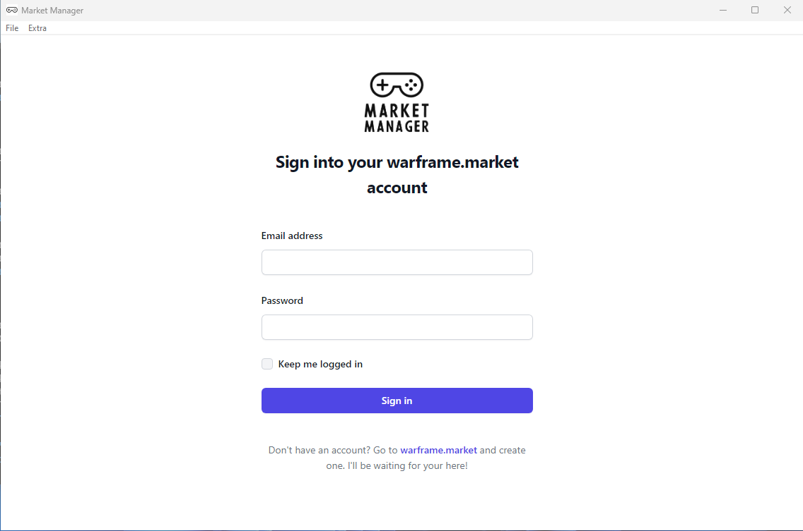
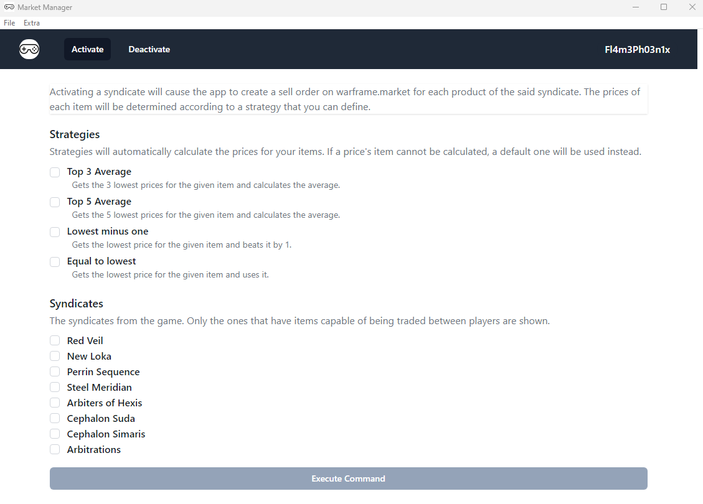
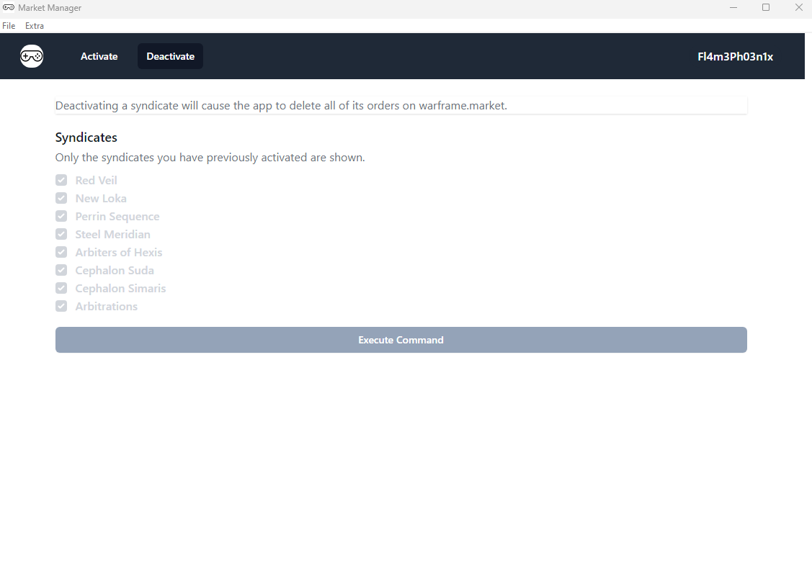
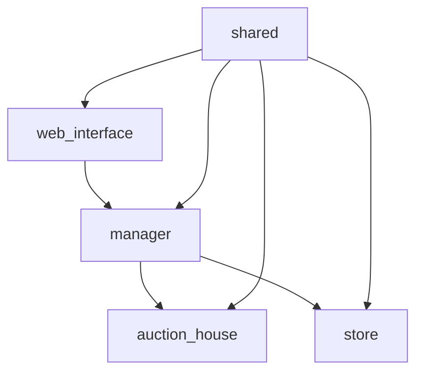

    

    
    

# MarketManager

Makes sell requests in batch to warframe market.
Used when you want to sell a lot of things or remove them from your list all at once. Specially useful for syndicates 
because you don't have to buy everything in advance and then sell. You only need to do 3 things:

- Launch the manager
- Activate a syndicate(s) you want
- Sit back and relax

Then, when someone pings you to buy an item, you can go the syndicate, buy it and sell it on the spot.

WarframeMarket (the website) does have a 100 items limit though, so you may want to keep this in mind as you won't be 
able to activate everything (unless you are a Patreon, in which case the limit does not apply).

# Requirements

This application has no requirements on the user side, as the entire erlang VM and context are bundled together with the 
application in the zip file.

By default the application will open a separate browser window and it will run there using your localhost.

If however, you wish to run the application in windowed mode, you can do so by downloading and installing WebView2 
support for Edge:

- <https://developer.microsoft.com/en-us/microsoft-edge/webview2/?form=MA13LH>

After the installation, the application will default to the windowed mode. You can however still use the browser if you 
wish by going to **Extras -> Open in browser**.

# User guide

As a user, you will see two windows opening. The **interface** (explained in the next subchapter) and the **terminal**.
The terminal is there for mostly two things:

- transparency to the user: This way you can see what the application is really doing.
- debugging: By seeing the logs, you can help contribute with errors. 

For this reason, I won't be explaining anything about the terminal, although it is important to note that **if you kill
the terminal (by closing it), you will also kill the application**. This can be useful, in case the apps bugs out, which 
should be rare.

## Interface

This section has some basic references and help for users that want to learn how to use the application.

Once you download and extract the contents of the zip file, you can launch the application via the shortcut. 
(You need to give Windows the necessary permissions, which will pop up)

With that out of the day you will be greeted with the login menu:

    

It is important to note that the application **does not save your credentials**. We only save an authentication token
that expires after some time. 
Furthermore, your credentials **are not transmitted anywhere**, so you don't have to worry about that.

Once the login is done, you can either activate or deactivate a set of syndicates.

    

Activating and deactivating are both operations that can take a long time, so you usually see a progress screen:

    

You can also logout by clicking in your username at the top right corner if you wish.

# Developer Guide

This guide describes a developer setup for Windows.

## Requirements

- Erlang OTP >= 26: <https://www.erlang.org/downloads>
- Elixir >= 1.16 (I recommend the installer): <https://elixir-lang.org/install.html#windows>
- wxWidget: <https://www.wxwidgets.org/downloads/>
- While it doesn't require a lot of memory to run, it does require a lot of memory to compile, at least 4GB.
- If using powershell, you need to have permissions to run scripts: `Set-ExecutionPolicy -ExecutionPolicy Bypass`
- Install chocolatey: <https://chocolatey.org/install>
- Install bakeware dependencies: `choco install -y zstandard make mingw`
- Setup powershell environment variables `$env:CC="gcc"` and `$env:MAKE="make"`
- An editor of your choice. I use VScode with some plugins and the `Fira Code` font: <https://github.com/tonsky/FiraCode>
- To test the application in Windowed mode, you also need to install WebView2 support for Edge. Refer to the 
**User Guide** section for more information.

## How to run it

After the initial setup, the following commands are used to get started:

- `mix local.hex` to install / update hex
- `mix archive.install hex phx_new` to install the Phoenix framework
- `mix deps.get` fetches and installs all the dependencies
- `mix test` run all tests
- `mix test.watch` runs all tests continuously and re-runs them every time a file changes

## Architecture

MarketManager is divided into multiple small applications/libraries, each one with a single purpose in mind:

- `web_interface` is a Phoenix application that holds all the code for the front-end. Works as the client.
- `manager` is the core of the application, the entry point for all user requests. It talks to the rest of the layers.
- `auction_house` is the app responsible for understanding and making requests to the given auction house. In this case, warframe market.
- `store` is the persistency layer. It saves your data and remembers what is being sold or not.
- `shared` is a library that holds the domain model entities of the entire project. 

For more information, feel free to read the README file of each application.

A previous version of MarketManager also had a `cli` application interfacing with `manager`. This can still be seen in the `v1` branch, which is being saved for posterity: <https://github.com/Fl4m3Ph03n1x/market_manager/tree/v1>

Do note that `v1` was the alpha release and is no longer being supported. It is still a very good resource for applications with CLI interfaces though.
