<p align="center">
    <a href="https://fl4m3ph03n1x.github.io/market_manager/">
        
    </a>
</p>

<p align="center">
    <a href="https://github.com/Fl4m3Ph03n1x/market_manager/workflows/build/badge.svg?branch=master">
        
    </a>
    <a href="https://coveralls.io/github/Fl4m3Ph03n1x/market_manager?branch=master">
        
    </a>
</p>

# MarketManager

Makes sell requests in batch to warframe market.
Used when you want to sell a lot of things or remove them from your list all at
once. Specially useful for syndicates because you don't have to buy everything
in advance and then sell. You only need to do 3 things:

- Launch the manager
- Activate a syndicate(s) you want
- Sit back and relax

Then, when someone pings you to buy an item, you can go the syndicate, buy it 
and sell it on the spot.

WarframeMarket (the website) does have a 100 items limit though, so you may want
to keep this in mind as you won't be able to activate everything (unless you 
are a Patreon, in which case the limit does not apply).

# User guide

This section has some basic references and help for users that want to learn how
to use the applciation.
## Setup

Before using this application you need to get access to two things:
1. x-rfctoken from warframe.market
2. a cookie from warframe.market

To get both of them you can:
1. Login with your account to warframe.market
2. Set you status to "Invisible"
3. Go to "My profile"
4. Click "Place order" button and fill in the form, BUT DO NOT PRESS "POST"
5. Using your favorite browser enter the developer's console (usually by pressing F12)
6. Go to the network section of the developer's console, clear it (if it has previous logs) and start monitoring
7. Press the "POST" button on the form
8. The console should have logged a POST request to the website
9. Inspect the request and look for "Request headers"
10. Copy the cookie and the token to somewhere

Once you have the cookie and the token, go to the `Authenticate` menu on the 
sidebar and save them.

You are now ready to use the appliction.
## Usage

The inventory file is called `products.json`. This file contain a list of 
objects, each one with an array of things to sell alongside some additional 
information.

It only supports mods currently.

```json
{
    "red_veil": [
        {
            "name": "Gleaming Blight",
            "id": "54a74454e779892d5e5155d5",
            "min_price": 14,
            "default_price": 16
        },
        {
            "name": "Eroding Blight",
            "id": "54a74454e779892d5e5155a0",
            "min_price": 14,
	    "default_price": 16
        }
    ],
    "new_loka": [
        {
            "name": "Winds of purity",
            "id": "54a74455e779892d5e51569a",
            "min_price": 14,
	    "default_price": 16
        },
        {
            "name": "Disarming purity",
            "id": "5911f11d97a0add8e9d5da4c",
            "min_price": 14,
	    "default_price": 16
        }
    ]
}
```

The format of each item is the following:

```
{
  "name": "Disarming purity",       //name of the item. DON'T TOUCH THIS.
  "id": "5911f11d97a0add8e9d5da4c", //warframe.market item id. DON'T TOUCH THIS.
  "min_price": 14,                  //prices are calculated by the chosen strategy. This will overried the startegie's price if the calculated price is inferior. A safety net, this is the minimum price you will sell this item for. 
  "default_price":16,               //if no one is selling this item or if the strategy was unable to calculte a price for the item, this is the value you will sell it for.
  "rank": 1,                        //rank of the mod, defaults to 0. If the mod has no rank use "n/a" instead
  "quantity": 1                     //number of items to sell, defaults to 1
}
```

I provide some basic defualts in the `products.json` based on my personal 
experience. Feel free to change the defaults to your liking. Once this is done, 
you are ready to go.

# Developmer Guide

This guide describes a developer setup for Windows. 

## Requirements

- Erlang OTP >= 24: https://www.erlang.org/downloads
- Elixir >= 1.13 (I recommend the installer): https://elixir-lang.org/install.html#windows
- wxWidget: https://www.wxwidgets.org/downloads/
- While it doesn't require a lot of memory to run, it does require a lot of memory to compile, at least 4GB.
- Setup powershell environment variables `$env:CC="gcc"` and `$env:MAKE="make"`
- An editor of your choise. I use VScode with some plugins and Fira Code font: https://github.com/tonsky/FiraCode

## How to run it

After the initial setup, the following commands are used to get started:
- `mix local.hex` to install / update hex
- `mix archive.install hex phx_new` to install the Phoenix framework
- `mix deps.get` fetches and installs all the dependencies
- `mix test` run all tests
- `mix test.watch` runs all tests continuously and re-runs them every time a file changes

## Architecture

MarketManager is divided into multiple small applications/libraries, ech one 
with a single purpose in mind:



`web_interface` is a Phoenix application that holds all the code for the front-end. 
`manager` is the core of the application, the entry point for all user requests. It talks to the rest of the layers. 
`auction_house` is the app responsible for understanding and making requests to the given auction house. In this case, warframe market.
`store` is the persistency layer. It saves your data and remembers what is being selled or not.

For more information, feel free to read the README file of each application. 

A previous version of MarketManager also had a `cli` application interfacing 
with `manager`. This can still be seen in the `v1` branch, which is being saved 
for posterity: https://github.com/Fl4m3Ph03n1x/market_manager/tree/v1

Do note that `v1` was the alpha release and is no longer being supported. It is 
still a very good resrouce for applicatinons with CLI interfaces though.