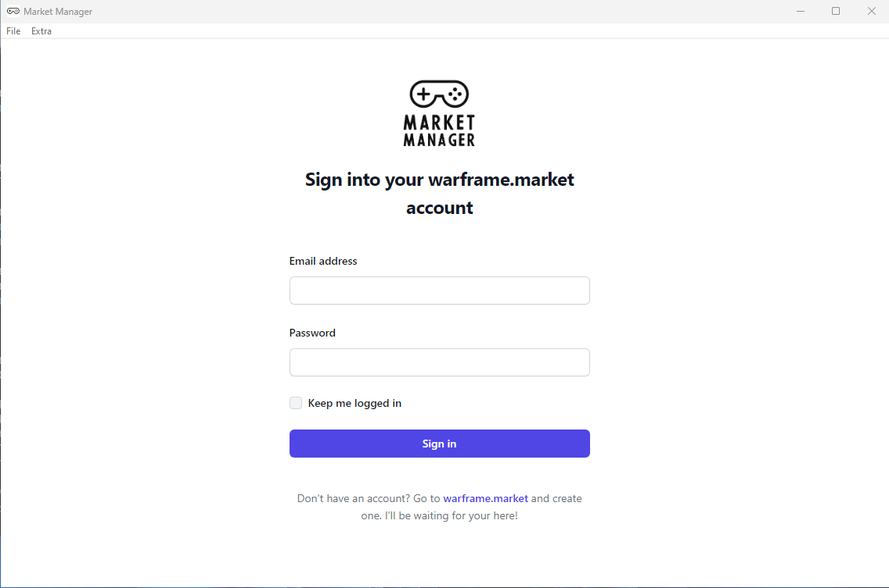
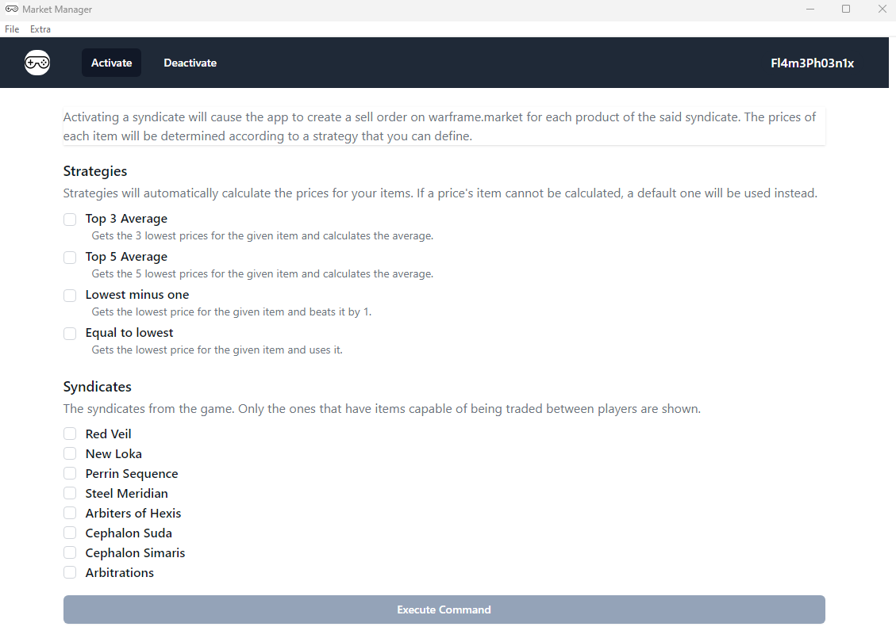
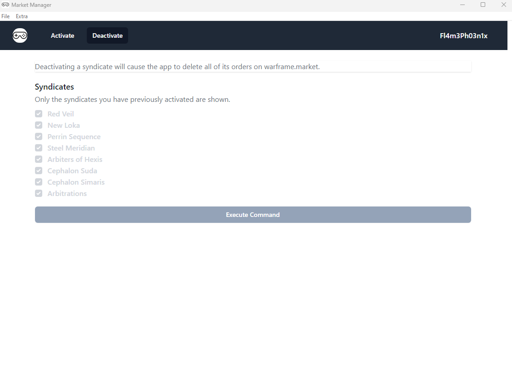
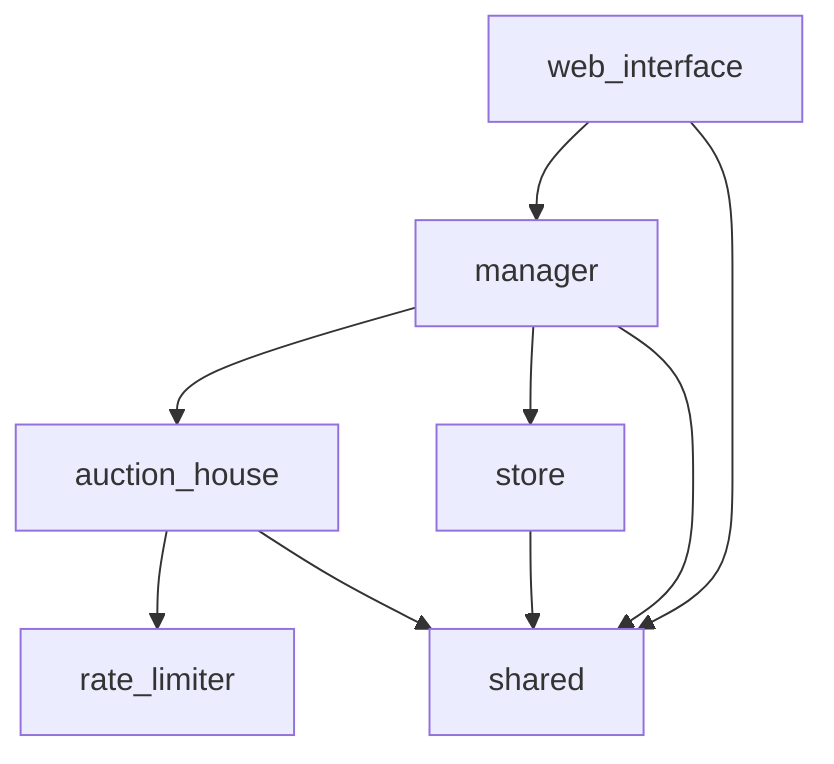

<p align="center">
    <a href="https://fl4m3ph03n1x.github.io/market_manager/">
        
    </a>
</p>

<p align="center">
    <a href="https://github.com/Fl4m3Ph03n1x/market_manager/actions/workflows/master.yml">
        
    </a>
    <a href="https://coveralls.io/github/Fl4m3Ph03n1x/market_manager?branch=master">
        
    </a>
</p>

# MarketManager

MarketManager makes sell requests in batches on Warframe Market. It is useful when you want to sell a large number of
items or remove them from your listings at once. It is especially useful for syndicates because you do not have to buy
everything in advance before listing it. You only need to:

- Launch MarketManager
- Activate one or more syndicates
- Sit back and relax

When someone asks to buy an item, go to the syndicate, buy it, and sell it immediately.

Non-Patreon accounts on Warframe Market (the website) have a limit of 100 listed items. Patreon accounts are not subject to this
limit. Keep this in mind when activating syndicates; you may not be able to activate everything at once.

# Requirements

The packaged application is a Windows x86_64 release. It includes the Erlang VM and its dependencies, so Erlang and Elixir are not required on the user's machine.

By default, the application opens a separate browser window and serves the interface from localhost.
To use the embedded windowed mode instead (like a normal windows application), install WebView2 for Edge:

- <https://developer.microsoft.com/en-us/microsoft-edge/webview2/?form=MA13LH>

After installation, the application defaults to windowed mode. You can still open the interface in your browser from **Extras -> Open Browser**.

# User guide

When you launch the application, two windows open: the **interface** and the **terminal**. The terminal is useful for:

- transparency: you can see what the application is doing;
- debugging: logs can help diagnose and report errors.

For this reason, I won't be explaining anything about the terminal, although it is important to note that **if you kill
the terminal (by closing it), you will also kill the application**. This can be useful, in case the apps bugs out, which 
should be rare.

## Interface

This section has some basic references and help for users that want to learn how to use the application.

Download and launch the application. Windows may ask for permission the first time it runs.

With that out of the day you will be greeted with the login menu:

<p align="center">    

</p>

The application **does not save your credentials**. It stores only an authentication token, which expires after some
time. Your credentials **are not transmitted anywhere**.

Once the login is done, you can either activate or deactivate a set of syndicates.

<p align="center">    


</p>

Activating and deactivating are both operations that can take a long time, so you usually see a progress screen:

<p align="center">    

</p>

You can also logout by clicking in your username at the top right corner if you wish.

# Developer guide

This guide describes a Linux development setup. The CI workflow uses Elixir `1.20.x` and Erlang/OTP `28.5.x`.
The packaged release currently targets Windows x86_64; Linux is supported for development and local execution.

## Requirements

- Erlang/OTP 28.5.x: <https://www.erlang.org/downloads>
- Elixir 1.20.x: <https://elixir-lang.org/install.html>
- At least 4GB of memory for compilation.
- An editor of your choice. I use VS Code with the `Fira Code` font: <https://github.com/tonsky/FiraCode>
- Wine, required only when building the Windows release locally: <https://www.winehq.org/>
- Resource Hacker, required only when building the Windows release locally: <https://www.angusj.com/resourcehacker/>

On Debian or Ubuntu, install the native build and wxWidgets dependencies with:

```bash
sudo apt update
sudo apt install build-essential libwxgtk3.2-dev pkg-config zstd wine
```

For other Linux distributions, install the equivalent packages for GCC, Make, wxWidgets development headers, `pkg-config`,
Zstandard, and Wine.

If you build the Windows release locally, install Resource Hacker in the default Wine prefix. The release task expects it
at `~/.wine/drive_c/Program Files (x86)/Resource Hacker/ResourceHacker.exe`.

Download the Windows installer from the [Resource Hacker website](https://www.angusj.com/resourcehacker/), then run it
with Wine. For example, if the installer is saved in `~/Downloads/reshack_setup.exe`:

```bash
wine ~/Downloads/reshack_setup.exe
```

Accept the default installation directory so the release task can find `ResourceHacker.exe`.

## How to run it

After the initial setup, the following commands are used to get started:

Run these commands from the repository root:

- `mix local.hex --force` installs or updates Hex.
- `mix local.rebar --force` installs the Rebar build tool.
- `mix deps.get` fetches all dependencies.
- `mix compile` compiles the umbrella project.
- `mix test` runs all tests.
- `mix credo --strict` runs the code-quality checks.
- `mix dialyzer` runs the type analysis.

To run the Phoenix interface locally, change into `apps/web_interface` and run `MIX_ENV=prod mix phx.server`:

```bash
cd apps/web_interface
MIX_ENV=prod mix phx.server
```

The release definition in `mix.exs` uses Burrito to build a Windows x86_64 executable and adds the application icon
during the packaging step.

## Architecture

MarketManager is divided into multiple small applications/libraries, each one with a single purpose in mind:


```mermaid
  graph TD;
      web_interface-->manager;
      web_interface-->shared;
      manager-->auction_house;
      manager-->store;
      manager-->shared;
      auction_house-->rate_limiter;
      auction_house-->shared;
      store-->shared;
```

- `web_interface` is a Phoenix application that holds all the code for the front-end. Works as the client.
- `manager` is the core of the application, the entry point for all user requests. It talks to the rest of the layers.
- `auction_house` is the app responsible for understanding and making requests to the given auction house. In this case, warframe market.
- `store` is the persistency layer. It saves your data and remembers what is being sold or not.
- `shared` is a library that holds the domain model entities of the entire project. 
- `rate_limiter` is a library focused on limiting the rate at which requests are made to the market, to avoid being blocked.

For more information, feel free to read the README file of each application.

A previous version of MarketManager also had a `cli` application interfacing with `manager`. This can still be seen in the `v1` branch, which is being saved for posterity: <https://github.com/Fl4m3Ph03n1x/market_manager/tree/v1>

Do note that `v1` was the alpha release and is no longer being supported. It is still a very good resource for applications with CLI interfaces though.
