# AuctionHouse

This is a Runtime Library (a library with GenServers) that manages the requests to the `warframe.market` Auction House. 

## How to use it?

This project is **not** an OTP application, meaning that to use it you need to include it in the Supervision tree of your application as one of its children.

```elixir
children = [
  AuctionHouse,
  # ...
]
Supervisor.init(children, strategy: :one_for_one)
```

Why is this not an OTP application? Well, because it doesn't need to.
This Library is not supposed to handle the weight of the world. It is only supposed to Manage requests and responses to a website. That's it. 
It just so happens that doing so creates some Non Functional requirements and that is why we have GenServer's to deal with them. 

Because of this if you want to play around with this project you must first start the `GenServer` and then use the Public API to play around.

This application is used by the `manager` library.
The dependencies graph can be seen as follows:



## Developer Guide

### Launching the app 

You can launch the application and test it manually as a standalone by following
these steps:

```
# export MIX_ENV=prod
# @set MIX_ENV=prod

alias AuctionHouse.Data.Credentials

{:ok, _pid} = AuctionHouse.Runtime.Server.start_link()
creds = Credentials.new("username", "password")
{:ok, _user} = AuctionHouse.login(creds)

# Place orders and do things here!
```

### Testing

The most important thing to mention here is that there are 2 main types of tests:
 - Unit
 - Integration

Unit tests have no side effects and use dummies. 
Integration tests do actually create and delete files and write in disk. 

You can execute them by running:

 - `mix deps.get`
 - `mix test` # runs all tests
 - `mix test.unit` runs unit tests only
 - `mix test.integration` runs integration tests only


### Usage

To use this library into your project, simply add it to your `mix.exs`:

```elixir
def deps do
  [
    {:auction_house, in_umbrella: true}
  ]
end
```

And then in your `config/config.exs` (or equivalent):

```elixir
config :auction_house,
  api_base_url: "http://localhost:8082/v1/profile/orders",
  api_search_url: "http://localhost:8082/v1/items",
  market_signin_url: "http://localhost:8082/auth/signin",
  api_signin_url: "http://localhost:8082/v1/auth/signin"
```
