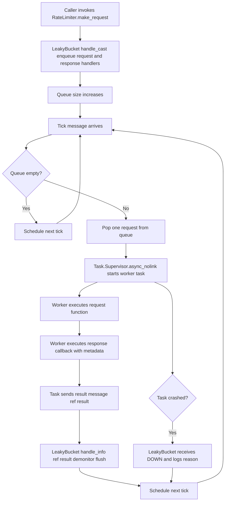

# RateLimiter

RateLimiter is a small queue-based throttling app used in this umbrella project.
It currently provides a leaky-bucket style limiter implemented with a GenServer
and per-request Task workers.

## Project Evaluation

Current state is good for the intended use case in this repository:

- API is simple: enqueue a request function and a response callback.
- Throughput is controlled by tick rate derived from requests-per-second.
- Task failures do not crash the limiter process.
- Test coverage includes happy-path flow, empty-queue behavior, and single/multiple task failure scenarios.

Known constraints to keep in mind:

- The limiter depends on a named Task.Supervisor: `RateLimiter.TaskSupervisor`.
- Limiter config is compile-time (`Application.compile_env!`), so runtime config changes do not apply until recompilation.
- `requests_per_second` must be greater than 0 (refresh-rate calculation divides by this value).
- Queue size is unbounded.

## Modules

- `RateLimiter`:
  Behaviour and public entrypoint (`make_request/2`), plus helper config functions.
- `RateLimiter.LeakyBucket`:
  GenServer implementation that drains one queued request per tick.

## Configuration

Configured in umbrella config files (for example `config/dev.exs`):

```elixir
config :rate_limiter,
  algorithm: RateLimiter.LeakyBucket,
  requests_per_second: 1
```

## Supervision Requirements

This app does not start the limiter and task supervisor for you. The hosting app
must include both in its supervision tree:

```elixir
children = [
  {Task.Supervisor, name: RateLimiter.TaskSupervisor},
  {RateLimiter.LeakyBucket, %{requests_per_second: RateLimiter.get_requests_per_second()}}
]

Supervisor.start_link(children, strategy: :one_for_one)
```

## Usage

Enqueue work through `RateLimiter.make_request/2`:

```elixir
request_handler = {fn id -> {:ok, id} end, [123]}

response_handler =
  {
    fn response, metadata ->
      IO.inspect({response, metadata})
    end, 
    %{source: :example}
  }

RateLimiter.make_request(request_handler, response_handler)
```

`request_handler` is a tuple of `{function, args}` and `response_handler` is a
tuple of `{callback, metadata}` where callback arity is 2.

## Failure Semantics

- Request execution and response callback run in supervised tasks.
- If a task crashes, the limiter receives `:DOWN`, logs the reason, and continues.
- The limiter process is not linked to worker tasks (`Task.Supervisor.async_nolink/2`).

## Flowchart




