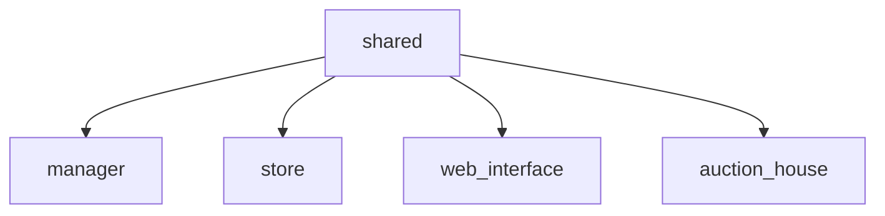

# Shared

This is a Functional Library that holds general utility functions used across 
all the project. 

It also holds the DataStructures and Types used to represent the Domain. 

As you can see from below, every app depends on this library.



This is admittedly not a great idea, as I am leaking core domains concepts to the `web_interface` (which acts as a 
client) and is something that I should be tackled in the future once I have more time.

## Developer Guide

### Testing

Since this is a functional library, there are only unit tests. You can run them
via `mix test`.

### Usage

To use this library into your project, simply add it to your `mix.exs`:

```elixir
def deps do
  [
    {:shared, in_umbrella: true}
  ]
end
```
