# Web Interface

Web interface for the MarketManager application:

This interface interacts with the `manager` and makes requests to it.
It then interprets its answers into a format that humans hopefully enjoy looking at without bleeding from their eyes (I make no promises!).

# User guide

The interface tries to be as self explanatory as possible. 
Generally, it has a menu of actions that you can perform. These actions are on the left sidebar and can be performed 
against syndicates or setup logic. 

For the time being there is some setup you need to do outside of the application (setting environment variables and tokens and 
such) but this will hopefully change in the future.

For more information read the "Setup" section of the project repo:

 - https://github.com/Fl4m3Ph03n1x/market_manager

If you don't like the windowed version, you can also open it in your browser by going to `Extras -> Open in browser`.

## Developer Guide

As previously mentioned, this project only talks to the Manager. 

So as long as you communicate with it and understand what it says, you should be fine.

### Getting started

To start your Phoenix server:

  * Install dependencies with `mix deps.get`
  * Generate assets with `mix assets.deploy`
  * Copy the files inside of `market_manager/assets` to `market_manager/apps/web_interface`
  * Change the `setup` file to have valid credentials
  * Change the `market_manager/config/dev.exs` auction_house configuration to point to the real website if you want to test against it
  * Start Phoenix endpoint with `mix phx.server`

Now you can visit [`localhost:4000`](http://localhost:4000) from your browser.
