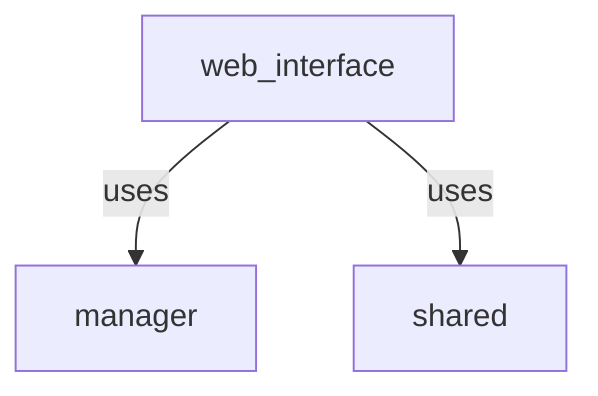

# WebInterface

To start your Phoenix server:

  * Run `mix setup` to install and setup dependencies
  * Start Phoenix endpoint with `iex -S mix phx.server`

It is important to note that you will need to run this application with `MIX_ENV=prod` or change the umbrella's 
configuration files. 

At this time, there are no mocks for the warframe market website, (nor for market manager) so the easiest way to test 
this application is to run it in production mode.

The dependency graph is as follow:

The second dependency will be removed in the future.

## Learn more

  * Official website: https://www.phoenixframework.org/
  * Guides: https://hexdocs.pm/phoenix/overview.html
  * Docs: https://hexdocs.pm/phoenix
  * Forum: https://elixirforum.com/c/phoenix-forum
  * Source: https://github.com/phoenixframework/phoenix
