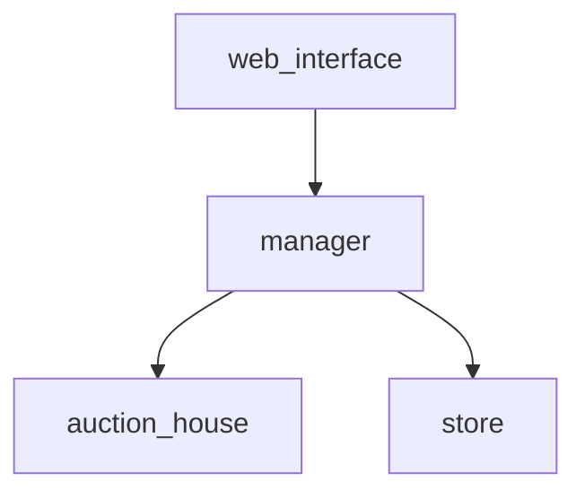

# Web Interface

Web interface for the MarketManager application:

This interface interacts with the Market Manager and makes requests to it.
It then interprets its answers into a format that humans hopefully enjoy looking at without bleeding from their eyes.

# User guide

The interface tries to be as self explanatory as possible. 
Generally, it has a menu of actions that you can perform. These actions are on the left sidebar and can be performed 
against syndicates or setup logic. 

For the time being there is some setup you need to do outside of the application (setting environment variables and tokens and 
such) but this will hopefully change in the future.

For more information read the "Setup" section of the project repo:

 - https://github.com/Fl4m3Ph03n1x/market_manager

# Developer Guide

As previously mentioned, this project only talks to the Manager. 
It is for this reason, that is you launch the project, you won't be able to make real petitions nor fake ones because
even though the Manager process is spun up (as a direct dependency of web_interface) the others aren't.

To fix this one could create a fake implementation of Manager just for dev play time, but at the moment this doesn't exist.

Your best option would be therefore to run it through the tests:

  * `mix test`

## Getting started

To start your Phoenix server:

  * Install dependencies with `mix deps.get`
  * Install Node.js dependencies with `npm install` inside the `assets` directory
  * Start Phoenix endpoint with `mix phx.server`

Now you can visit [`localhost:4000`](http://localhost:4000) from your browser.
