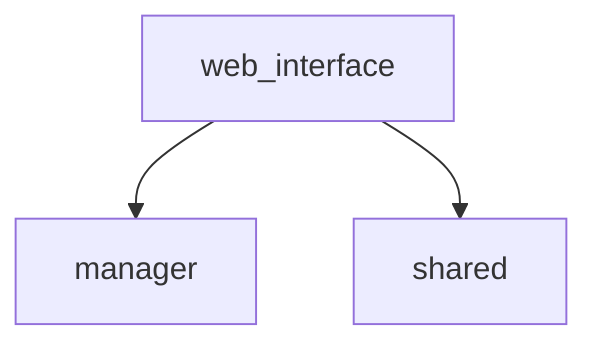

# WebInterface

`web_interface` is the Phoenix LiveView application for MarketManager. It provides the browser interface and coordinates user actions through the `manager` application.

## Setup

Run the dependency setup from the repository root:

```bash
mix local.hex --force
mix local.rebar --force
mix deps.get
mix compile
```

Then install and build the web assets from this application directory:

```bash
cd apps/web_interface
MIX_ENV=dev mix setup
```

`mix setup` fetches dependencies for the umbrella application and installs/builds the esbuild and Tailwind assets.

## Run Locally

Start the Phoenix endpoint in development mode:

```bash
cd apps/web_interface
MIX_ENV=dev mix phx.server
```

The interface is available at <http://localhost:4000>. To run it with an interactive Elixir shell, use:

```bash
MIX_ENV=dev iex -S mix phx.server
```

Development mode enables code reloading, debug errors, LiveView reloads, and the asset watchers. If you have the needed dependencies, windowed mode will be used by default. 

## Live Test In Production Mode

The repository does not provide a Warframe Market API mock, so login and order workflows require a compatible local service on that port. The UI can still be checked locally without completing those external API operations. 

For a manual end-to-end test against the real Warframe Market API, complete the setup above first, then run the production asset deployment and start the endpoint:

```bash
cd apps/web_interface
MIX_ENV=prod mix assets.deploy
MIX_ENV=prod mix phx.server
```

Open <http://localhost:4000>. Production mode uses the API URLs from `config/prod.exs` and the application data under `apps/web_interface/priv`, rather than the local fixture data and `localhost:8082` endpoints used in development mode.

Use an account and listings that are safe for manual testing as well as invisible mode on the website. Logging in, activating a syndicate, and deactivating a syndicate can make real requests, create real listings, or delete existing listings on Warframe Market.

Coverage can be regenerated from the repository root with:

```bash
mix coveralls -u
```

## Architecture

The diagram shows `web_interface`'s direct compile-time dependencies, not the complete umbrella graph:


```mermaid
graph TD
  web_interface --> manager
  web_interface --> shared
```

- `web_interface` contains the Phoenix endpoint, LiveViews, components, and browser-facing workflow.
- `manager` coordinates activation, deactivation, login, and other application workflows through sagas.

The main request flow is `web_interface -> manager`. The manager then coordinates persistence through all the other applications. See the main `README.md` for a complete view of the architecture. 

## Learn More

- Phoenix: <https://www.phoenixframework.org/>
- Phoenix guides: <https://hexdocs.pm/phoenix/overview.html>
- Phoenix documentation: <https://hexdocs.pm/phoenix>
- Phoenix forum: <https://elixirforum.com/c/phoenix-forum>
- Phoenix source: <https://github.com/phoenixframework/phoenix>
